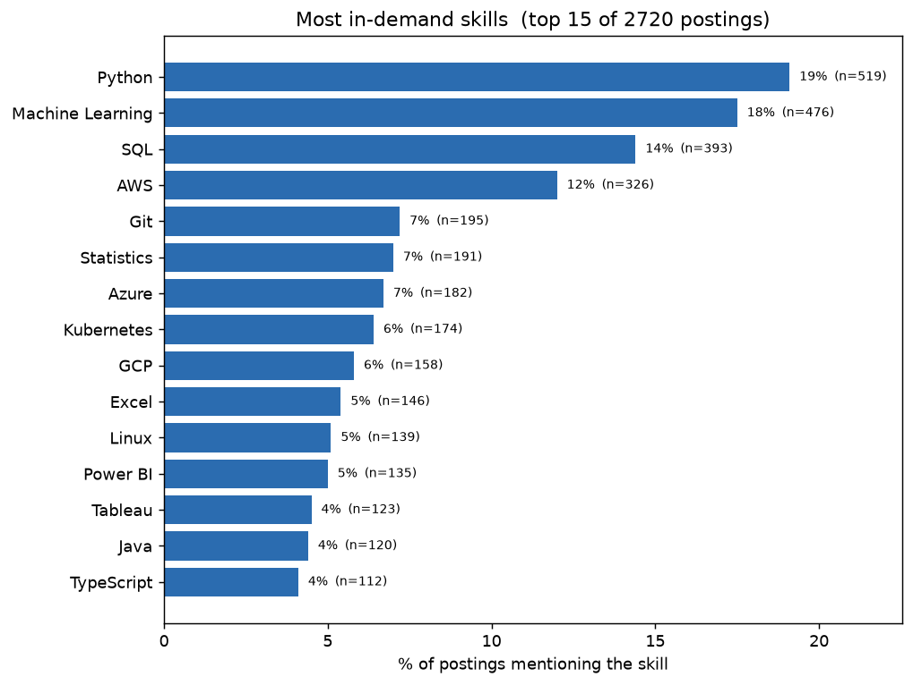
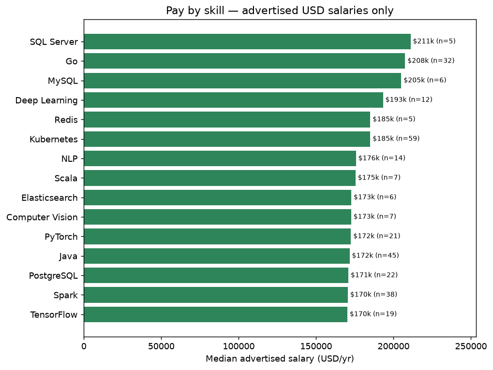
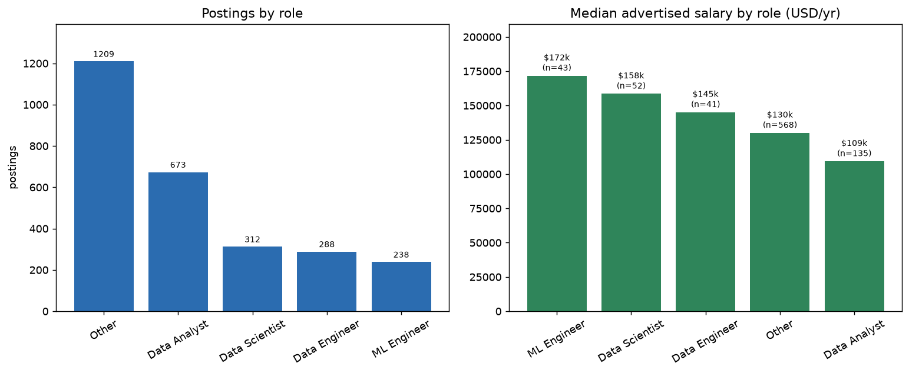
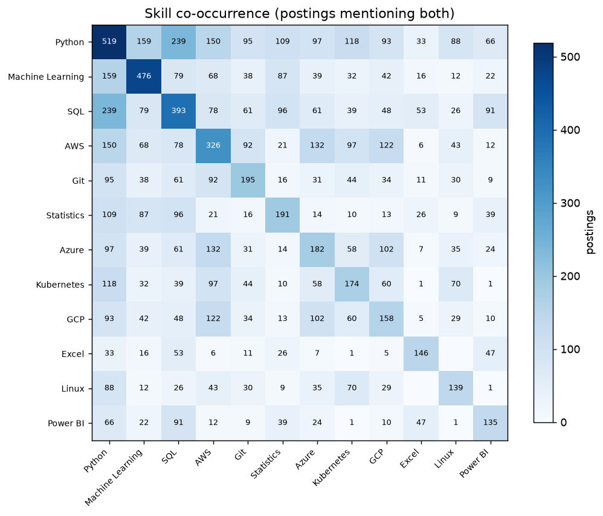
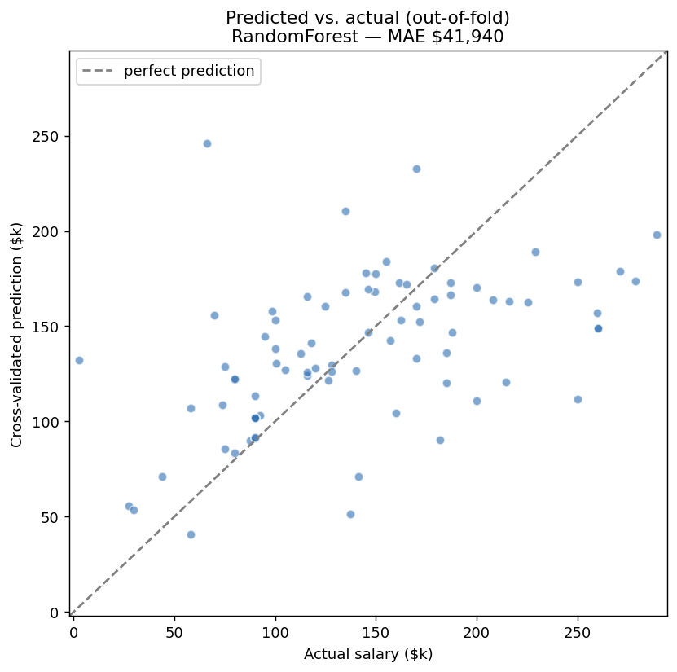

# Data Job Market Intelligence

[](https://github.com/DanielAntares/data-job-market-intelligence/actions/workflows/tests.yml)

**▶ [Live dashboard](https://data-job-market-intelligence.streamlit.app/)**  ·  **[📄 Project showcase](https://danielantares.github.io/data-job-market-intelligence/)**

**What skills are actually in demand for data roles, what do they pay, and how is that changing over time?**

This project answers that question with data instead of guesswork. It runs an
automated pipeline that collects data-job postings from public APIs, structures
the messy real-world fields (skills, salaries) hidden in their text, stores them
in a warehouse, and surfaces the trends. It runs on a schedule, so the dataset
gets richer over time.

> **Why this project exists.** Most data portfolios reuse the same clean Kaggle
> CSVs, which proves little about real work. Here the data is sourced from the
> wild, arrives messy, and has to be cleaned, parsed, and modeled end to end.

---

## Key findings

_From ~440 postings across 5 markets (Remote-international, US, Australia,
Malaysia, Indonesia). Directional, not definitive; regenerate them anytime with
`python -m src.report`, and they firm up as the scheduled collector accumulates
data._

- 🌏 **Local vs. remote demand differs sharply.** In **Indonesia**, roles lean
  analyst/BI: **SQL (77%)**, Python (73%), then Tableau/Power BI (~36%) and
  ETL/Airflow (data-engineering). **Remote-international** roles lean
  Python-first (57%) with more **ML and cloud (AWS, Git)**. Different skill prep
  depending on which market you target.
- 📊 **Across all markets, SQL + Python dominate**; everything else trails. A
  BI tool (Tableau/Power BI) is close to mandatory for local analyst roles.
- 💸 **Specialized ML skills carry a pay premium** (remote USD salaries):
  Deep Learning / PyTorch / TensorFlow roughly **$150k to $170k** vs roughly
  **$90k to $116k** for general analytics tooling. _(Small per-skill samples;
  salary data is scarce outside remote-USD, and local postings rarely advertise
  pay.)_

_Caveat: English-language postings; salary stats cover only the remote-USD subset
that advertises pay. See [Data & limitations](#data--limitations)._

### Charts

Generated by `python -m src.figures`; the full narrative walk-through lives in
[notebooks/analysis.ipynb](notebooks/analysis.ipynb).

| Demand | Pay by skill |
|---|---|
|  |  |
| **Roles compared** | **Skill co-occurrence** |
|  |  |

### Salary model (Phase 4)

Predicting advertised salary, done the honest way: a small regularised model,
5-fold cross-validation, and transparent limitations. On the current ~80
advertised-salary postings:

| Model | MAE (CV) | Notes |
|---|---|---|
| Baseline (global median) | ~$53k | the bar every model must clear |
| RidgeCV (skills + role + seniority) | ~$46k | interpretable coefficients |
| RandomForest | **~$42k** | best, **~21% better than baseline** |

R² is a modest ~0.15 (up from near zero when the dataset was smaller), so there
is some real signal, though advertised salary stays hard to predict from a
handful of features on this little data. The model's value is the *pipeline*: it
sharpens automatically as the collector accumulates more salaries.



**Interpretation (RidgeCV).** Python (**+$50k**), seniority (**+$38k**) and
Machine Learning (**+$17k**) push predicted pay up. Cloud shows a *negative*
coefficient, not because it lowers pay, but because in this small sample those
skills cluster in lower-paying roles (a confounding artifact the writeup calls
out explicitly). Directional, not causal.

### Interactive dashboard (Phase 5)

Deployed and live at **[data-job-market-intelligence.streamlit.app](https://data-job-market-intelligence.streamlit.app/)**.

To run it locally, on Windows just double-click [`run.bat`](run.bat). Otherwise:

```bash
python -m streamlit run app.py
```

> If `streamlit run app.py` errors with `No module named 'streamlit.cli'`, a
> stale launcher from another Python install is shadowing it; use `python -m
> streamlit run app.py` (or `run.bat`) instead.

A [Streamlit](https://streamlit.io/) app ([app.py](app.py)) that reuses the same
analysis and model code, so it never drifts from the report. It has filters
(role, source, work type), the four charts, a sortable posting explorer, and a
**live salary estimator**.

**How it's deployed (free):** the small warehouse `.parquet` files are committed
so the app has data, and [share.streamlit.io](https://share.streamlit.io) is
connected to this repo with `app.py` as the main file. No API keys are needed to
view it.

---

## How it works

```
 Sources (6 public APIs)          Pipeline                    Outputs
 Remotive  Jobicy  RemoteOK   ->  collect, normalize,     ->  data/raw/*.jsonl     (audit trail)
 Adzuna    Jooble  JSearch        parse salaries,             data/warehouse/
                                  extract skills, dedupe        jobs.parquet       (analysis-ready)
                                                                job_skills.parquet
```

- **Sources** ([src/sources/](src/sources/)): one small module per job board,
  all mapped onto a single [normalized schema](src/schema.py). Adding a board is
  about 30 lines.
- **Salary parsing** ([src/salary.py](src/salary.py)): turns free text like
  `"$80k - $100k"` or `"$18/hr"` into `(min, max, currency, period)`. The gnarly
  part, so it has its own [unit tests](tests/test_salary.py).
- **Skill extraction** ([src/skills/](src/skills/)): a curated
  [taxonomy](src/skills/taxonomy.py) of ~70 data skills plus a
  [matcher](src/skills/extractor.py) that resolves ambiguous names (`R` vs
  "R&D", `Java` vs `JavaScript`, `Excel` vs the verb). Output: a tidy
  `job_skills` table, one row per posting-skill pair.
- **Storage** ([src/storage.py](src/storage.py)): immutable raw snapshots for
  reproducibility, plus a deduplicated parquet warehouse that tracks when each
  posting was `first_seen` and `last_seen`.
- **Insights** ([src/report.py](src/report.py)): skill demand and median
  advertised pay per skill, plus a per-source data-quality audit.

## Quickstart

```bash
# 1. Install (a virtual environment is recommended)
python -m venv .venv
.venv\Scripts\activate          # Windows
# source .venv/bin/activate     # macOS/Linux
pip install -r requirements.txt

# 2. (Optional) add API keys to unlock more sources and markets:
#    copy .env.example to .env and paste your free keys.
#    Adzuna = US/Australia; Jooble + RapidAPI (JSearch) = Indonesia/Malaysia.
#    Remotive, Jobicy and RemoteOK need no keys, so you can skip this and still run.

# 3. Collect postings (writes data/warehouse/jobs.parquet)
python -m src.collect

# 4. Extract skills + print the demand & salary report
python -m src.extract_skills

# 5. Render the charts (PNGs into reports/figures/)
python -m src.figures

# 6. Train + cross-validate the salary model (baseline vs models)
python -m src.model

# 7. Launch the interactive dashboard
python -m streamlit run app.py    # more robust than `streamlit run` if you
                                  # have multiple Python installs

# Anytime: peek at raw data, re-print insights
python -m src.peek
python -m src.report
```

For tests and the notebook, install the dev extras:

```bash
pip install -r requirements-dev.txt
pytest
jupyter notebook notebooks/analysis.ipynb
```

Or just double-click [`update-data.bat`](update-data.bat) to refresh everything
in one go. Re-run `python -m src.collect` whenever you like; it tops up the
warehouse and deduplicates automatically. Tune what gets collected in
[config.yaml](config.yaml).

## Project status / roadmap

- [x] **Phase 1: Collection.** Multi-source pipeline, normalized schema, salary
      parser + tests, deduplicated warehouse, raw audit snapshots.
- [x] **Phase 2: Skill extraction.** Curated taxonomy (~70 skills) plus a matcher
      that handles ambiguous names (`R` vs "R&D", `Java` vs `JavaScript`, `Excel`
      vs the verb); tidy `job_skills` table; demand + salary-by-skill report.
- [x] **Phase 3: Analysis & insights.** Demand, pay-by-skill, role comparison and
      skill co-occurrence as a text report (`src/report.py`), reproducible charts
      (`src/figures.py`), and a narrative notebook.
- [x] **Phase 4: Salary model.** Baseline-first, RidgeCV + RandomForest, 5-fold
      cross-validation, interpretable coefficients, honest error reporting
      (`src/model.py`).
- [x] **Phase 5: Dashboard.** Interactive Streamlit app ([app.py](app.py)) with
      filters, charts, a posting explorer and a live salary estimator, deployed
      live on Streamlit Community Cloud.
- [x] **Phase 6: Automation.** Scheduled weekly data refresh via GitHub Actions,
      plus a CI tests workflow.

## Data & limitations

- **Sources & markets:** every posting is tagged with a `market` so you can
  compare, for example, *Indonesia* vs *Remote-international* vs *Australia*:
  | Source | Market(s) | Strength | Caveat |
  |---|---|---|---|
  | [Remotive](https://remotive.com/), [Jobicy](https://jobicy.com/) | Remote (international) | real advertised USD salaries | remote-only |
  | [RemoteOK](https://remoteok.com/api) | Remote (international) | popular board, free | tags are SEO-spam (we title-filter) |
  | [Adzuna](https://developer.adzuna.com/) | US, Australia (any of its countries) | volume, geography, on-site roles | salaries mostly *estimates*; no Indonesia/Malaysia |
  | [Jooble](https://jooble.org/api/about) | Indonesia, Malaysia | local coverage exists | **very thin** for data roles; no skills/salary |
  | [JSearch](https://rapidapi.com/letscrape-6bRBa3QguO5/api/jsearch) | any country incl. Indonesia | aggregates Google for Jobs (LinkedIn/Indeed/Glassdoor) | needs RapidAPI key; free tier rate-limited |
- **The local-data reality:** free APIs barely cover the Indonesian data-job
  market (Jooble returns ~1 real Indonesian data role). **JSearch** is the only
  realistic path to meaningful local data, since it taps the big boards that
  actually carry those postings.
- **Predicted vs advertised salary:** Adzuna fills in an estimated salary
  (`salary_is_predicted = true`) when a posting doesn't state one. Those are
  flagged and **excluded from salary modeling**, or you'd be modeling Adzuna's
  model. Only about a third of salaried postings carry a genuinely advertised
  number.
- **Coverage bias:** still skews English-language and tech-forward; remote vs
  on-site is now roughly balanced thanks to Adzuna. Treat findings as
  directional, not census-accurate.
- **Skill extraction is dictionary-based:** high precision (few false hits) but
  bounded recall, since a skill only counts if it's in the
  [taxonomy](src/skills/taxonomy.py). Add entries to widen coverage.
- **Description truncation is surfaced, not hidden.** Some sources return short
  teasers (Adzuna averages ~500 chars vs ~2,400 to 6,300 for
  Jobicy/JSearch/RemoteOK), so a missing skill there is *missing data*, not a true
  "not required". Rather than silently drop that data, the report and dashboard
  show a **per-source quality audit** (`quality_by_source`), and demand can
  *optionally* be recomputed over detailed postings only (the `rich_only`
  toggle). Adzuna still earns its place for volume, geography and on-site coverage.
- **Ethics:** official JSON APIs (no scraping behind logins), modest request
  volumes, public posting fields only. API keys live in a git-ignored `.env`.

### Configuring sources

Toggle sources and search terms in [config.yaml](config.yaml). Some sources need
a free key, added to `.env` (copy [.env.example](.env.example) first): Adzuna
(`app_id` / `app_key` from <https://developer.adzuna.com/>), Jooble
(<https://jooble.org/api/about>), and RapidAPI for JSearch
(<https://rapidapi.com/letscrape-6bRBa3QguO5/api/jsearch>). Adding a brand-new job
board is about 30 lines: subclass `BaseSource` in [src/sources/](src/sources/)
and register it.

## Tech

Python, `requests`, `pandas` / `pyarrow` (parquet), `BeautifulSoup`,
`scikit-learn`, `matplotlib`, `streamlit`, Jupyter, and `pytest`, with GitHub
Actions for CI and the scheduled data refresh.
